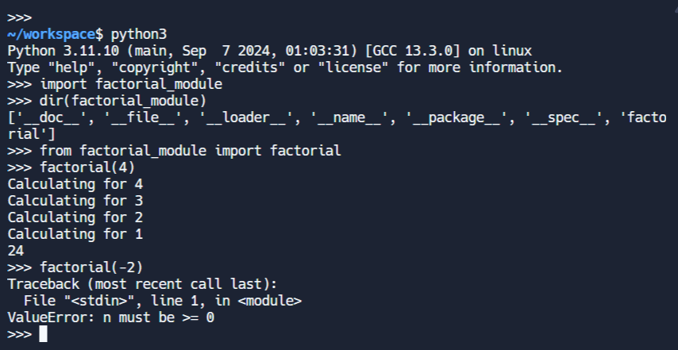

An example of how Python integrates 
with a C language function


# Instructions to Build

```bash
$ python3 setup.py build
$ python3 setup.py install
```

### Example main.py

```py
import factorial_module
print(factorial_module.factorial(5))   # → 120
```


Click the "Run" button in replit, or 

```bash
python3 main.py 
```

### In the Python intrepreter


